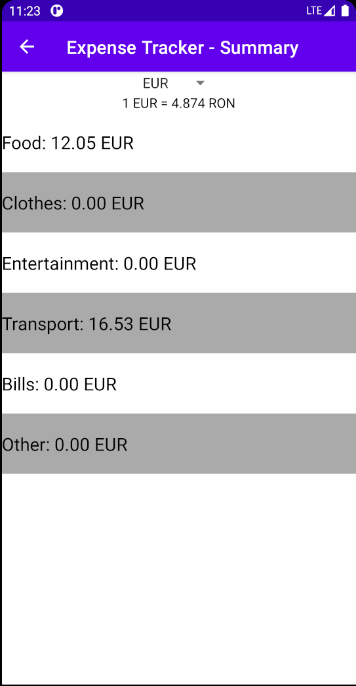

# ExpenseTracker
Simple app for tracking daily expenses. Add new expenses, edit them and delete old expenses. You can choose a currency to be used when expenses are added, currency exchange rates are automatically retrieved through an API call. The app also shows summary data about all the expenses grouped by type. You can login into the app through your Google account.

## Features
* Google login
* Add, update, delete expense
* Expenses stored locally in a Room database
* Select currency to use
* Currency rates updated daily

## Screenshots
|  |  |
|:--:|:--:|
| *Login activity* | *Expense list* |

|  |  |
|:--:|:--:|
| *Add expense* | *Update expense* |

|  |  
|:--:|:--:|
| *Navigation* | *Expense summary* |
